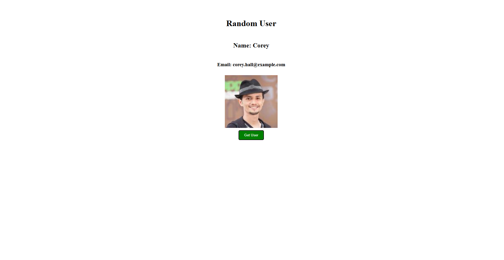

# Random User App

A simple JavaScript project that fetches random user data from an API and displays it on the screen.

## Features

* Fetch random users from an API
* Display user name
* Display user email
* Display profile picture
* Error handling using `try...catch`
* Uses modern JavaScript (`async/await`)

## Technologies Used

* HTML
* CSS
* JavaScript
* Fetch API

## What I Learned

In this project I practiced:

* `fetch()`
* `async/await`
* API handling
* JSON data
* DOM manipulation
* Error handling
* Object destructuring

## API Used

Random User API:

https://randomuser.me/api/

## How To Run

1. Clone the repository
2. Open `index.html`
3. Click the button to load a random user

## Future Improvements

* Add loading spinner
* Add dark mode
* Show more user details
* Add animations
* Generate multiple users

## Screenshot

## Author

Built with love by Rashidur Rahman Shawon (Zig Shaw)
